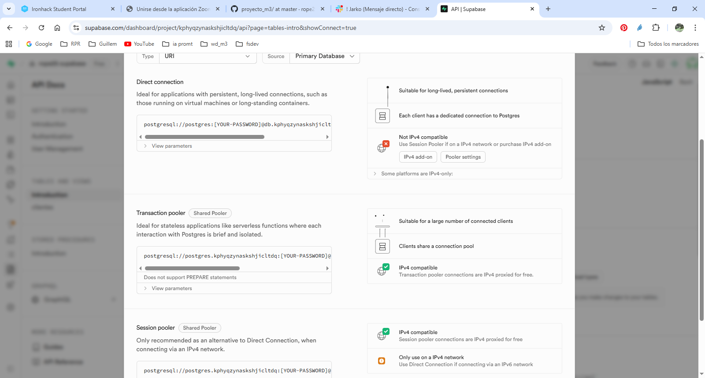
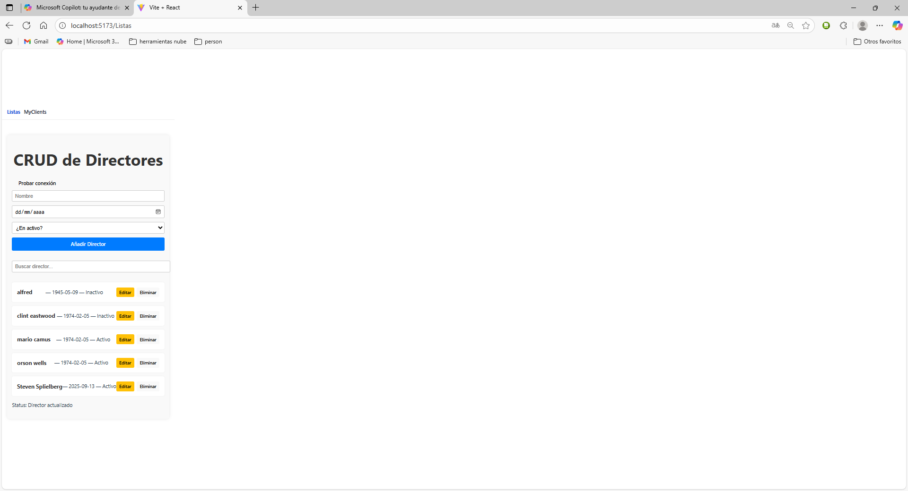

## 1 INSTALACIONES 
Repo + README + elección de stack.
Backend: esqueleto, /api/health, migración items, seed.
Front: proyecto base (Vite/CLI), router, página Lista + botón “Probar conexión”.

## 2 SUPABASE BACKEND
Creada una tabla llamada directores

## Datos para conectar el cliente con la API
-----------------------

Codigo tipo
// lib/supabase.ts
import { createClient } from '@supabase/supabase-js'

export const supabase = createClient(

process.env.NEXT_PUBLIC_SUPABASE_URL=https://xxxxxxxxxxxxxxxxx
process.env.NEXT_PUBLIC_SUPABASE_ANON_KEY=zzzzzzzzzzzz
)

  ## 2.1 RLS
ROW LEVEL SECURITY
Creo tambien esta caracteristica de seguridad es atributo desde supabase
// Row Level Security (RLS)
alter table public.clientes enable row level security;

## 3 PROGRAMACION APP

## FILTRO PAGINACION
--------------------------------------

El filtro por nombre de director nos permite realizar operaciones de busqueda , editar, borrar

// Filtro y paginación
const { data, error, count } = await supabase
  .from('orders')
  .select('id,total,created_at', { count: 'exact' })
  .gte('total', 50)
  .order('created_at', { ascending: false })
  .range(0, 49)

## APARTADO CLIENTES

##POLITICAS

Existen plantillas dentro de supabase para definir quien esta autorizado a realizar modificaciones en la base de datos

##AUTENTIFICAR

Tambien se establecen formas alternativas de autentificar usuarios desde Supabase
OAuth: Google, GitHub, GitLab, Azure AD, etc.

## IMAGENES

